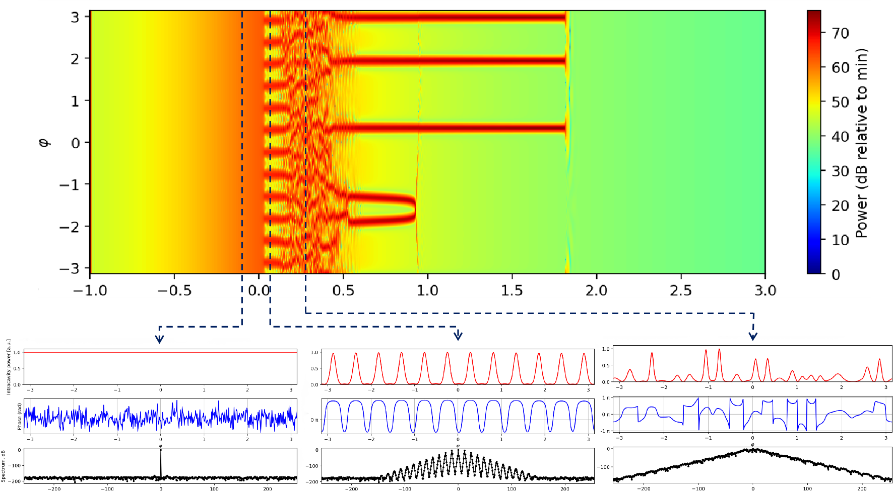
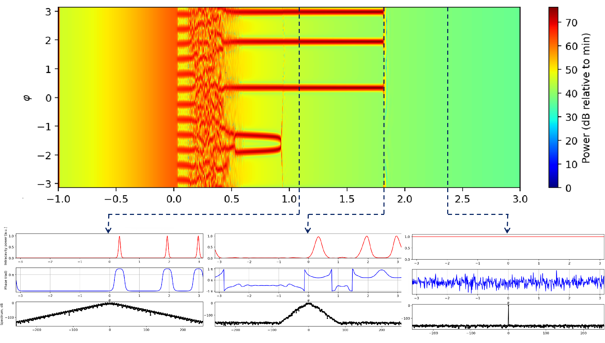
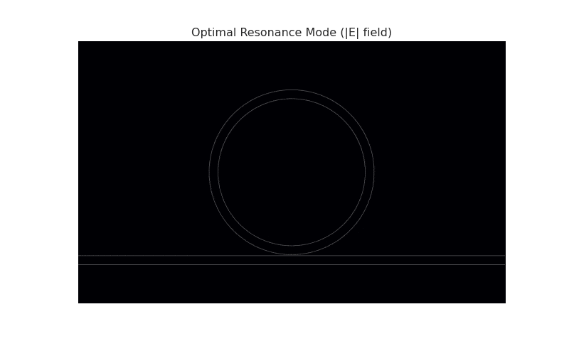
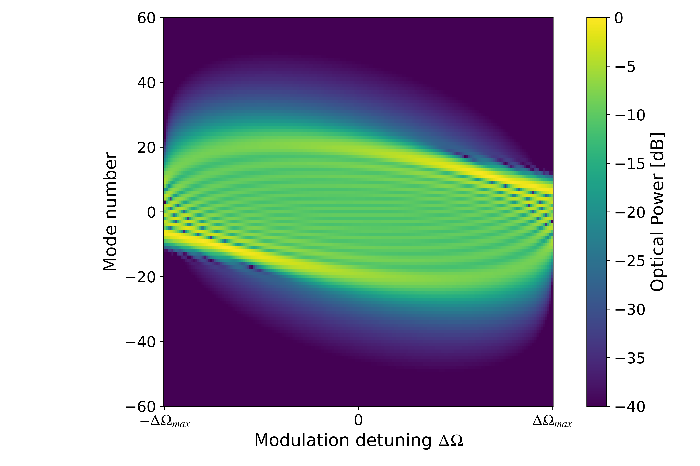

# Numerical Modeling of Microresonator Frequency Combs

**Author:** Haozheng    
**Research Interest:** Computational Nanophotonics, Quantum Devices

> ℹ️ **Project Overview:**
> This repository hosts the **numerical solvers, technical notes, and high-fidelity visualizations** regarding Dissipative Kerr Soliton (DKS) formation and QCL frequency comb dynamics.

---

## ⚡ Project Highlights
This project focuses on the high-performance numerical implementation of mean-field theories:

1.  **Lugiato-Lefever Equation (LLE) Solver:** Split-Step Fourier Method (SSFM) implementation for simulating Kerr frequency combs in high-Q microresonators.
2.  **Quantum Cascade Laser (QCL) Dynamics:** Time-domain modeling of FM comb generation and injection locking limits under RF modulation.
3.  **Stability Analysis:** Investigating the transition from chaotic modulation instability to stable soliton crystals.

---

## 📊 Visualizations & Results
*(Corresponds to the "soliton trajectories and intracavity field evolution" mentioned in SOP)*

### 1. Dissipative Kerr Soliton (DKS) Formation
Simulation of the intracavity field evolution across different detuning regimes.
*Implemented using the open-source [pyCORe](https://github.com/ElKosto/PyCORe) framework.*

| Blue Detuned Regime (Generation) | Red Detuned Regime (Existence & Decay) |
| :---: | :---: |
|  |  |
| *Fig 1a. Evolution in the **blue-detuned** region: Transition from **Continuous Wave (CW)** → **Turing patterns** → **Spatiotemporal Chaos**.* | *Fig 1b. Dynamics in the **red-detuned** region: Progression from stable **Solitons** → **Deteriorative Solitons** → Return to **CW state**.* |

### 2. Full-Wave FDTD Verification
FDTD simulation of the optical field propagation in the microring resonator.

*Fig 2. Electromagnetic field distribution (|E|) showing resonance buildup in the bus-ring coupling region.*

### 3. QCL Frequency Comb Spectra (Reproduction Study)
Numerical reproduction of the "Quantum Walk Comb" spectral locking dynamics.
*Ref: Heckelmann et al., Science 382, 434-438 (2023).*

*Fig 3. 2D spectral map as a function of the modulation detuning and frequency.*

---

## 📂 Repository Contents & Roadmap

| Component | Description | Status |
| :--- | :--- | :--- |
| **📄 Technical Note** | PDF detailing theoretical derivations (LLE/NLSE) and simulation results. | ✅ **Available** |
| **`LLE_Solver_Core`** | SSFM solver for dimensionless LLE, optimized for stability analysis. | 🔄 Cleaning up |
| **`QCL_Dynamics`** | Time-domain simulation for QCL FM comb dynamics. | 🔄 Cleaning up |
| **`AI_Optimization`** | *Extension module for inverse design using Bayesian Optimization.* | 🚧 **Planned (Jan 2026)** |

---

## 📬 Contact
For questions regarding the simulation methods or the technical note, please feel free to reach out.

📧 Email: hank.lou.tju@gmail.com